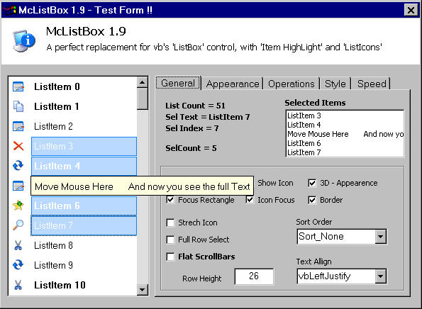



## McListBox 2\.2 \[ A perfect replacement for vb's ListBox \] \( \*All you need\!\! \)

### Description

Heavly improved version with Item completer, Subclassing, Api scrollbars, XP style, Mouse wheel... : It is a High Performance, Ownerdrawn and Stylish 'Listbox' control with many advantages inluding Multi-line selection, Custom list-icons, Item Highlighting, Unicode support, Adjustable RowHeight, List Sorting, Grid lines and nice Gradient effects. This control is an update for my 'ListBoxEx' control. It uses 'McImageList' for image reference. The imagelist control is also included in this zip. Check this out, and please give me your feedbacks!!, Jim Jose :-))
 
### More Info
 

             |
---                |---
**Submitted On**   |2005-07-24 22:24:38
**By**             |[JJJJJJJJ](https://github.com/Planet-Source-Code/PSCIndex/blob/master/ByAuthor/jjjjjjjj.md)
**Level**          |Intermediate
**User Rating**    |5.0 (228 globes from 46 users)
**Compatibility**  |VB 6\.0
**Category**       |[Custom Controls/ Forms/  Menus](https://github.com/Planet-Source-Code/PSCIndex/blob/master/ByCategory/custom-controls-forms-menus__1-4.md)
**World**          |[Visual Basic](https://github.com/Planet-Source-Code/PSCIndex/blob/master/ByWorld/visual-basic.md)
**Archive File**   |[McListBox\_1936039282005\.zip](https://github.com/Planet-Source-Code/jjjjjjjj-mclistbox-2-2-a-perfect-replacement-for-vb-s-listbox-all-you-need__1-62442/archive/master.zip)

